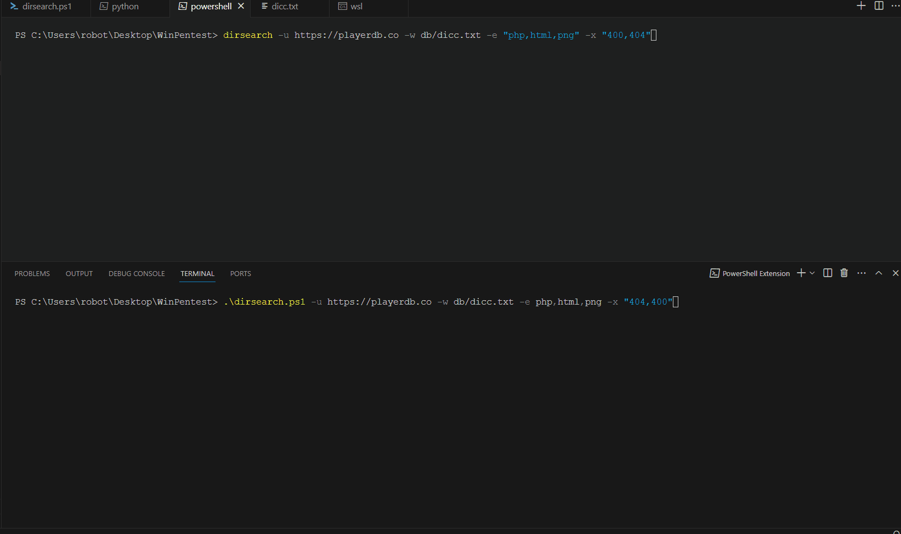

Currently just for dirsearch implementation until I modify it or split my focus on other code.

### Side by side with the real dirsearch
<p align="center">
  
</p>

```bash
Usage:
    -u <URL>
        The target URL to scan.
    -w <Wordlist Path>
        The path to the wordlist file. Default is 'db/dicc.txt'.
    -e <Extensions>
        Comma-separated list of file extensions to check. Default is 'php,aspx,jsp,html,js'.
    -x <Exclude Status>
        Comma-separated list of HTTP status codes to exclude from the output. Default is '404'.
    -threads <Number>
        Number of threads to use. Default is 10.
    -ExcludeSizes SIZES
        Exclude responses by sizes, separated by commas (e.g. 0B,4KB).

Example:
    .\dirsearch.ps1 -u https://example.com -w db/dicc.txt -e php,html,js -x "404,500" -ExcludeSizes "873B"
```

#### Notes:
1. Recursive not added
2. Excluding status codes needs a bit of work.
